From the Structy course
https://structy.net/problem-index

https://www.youtube.com/watch?v=oFkDldu3C_4&t=41s
Problem 3
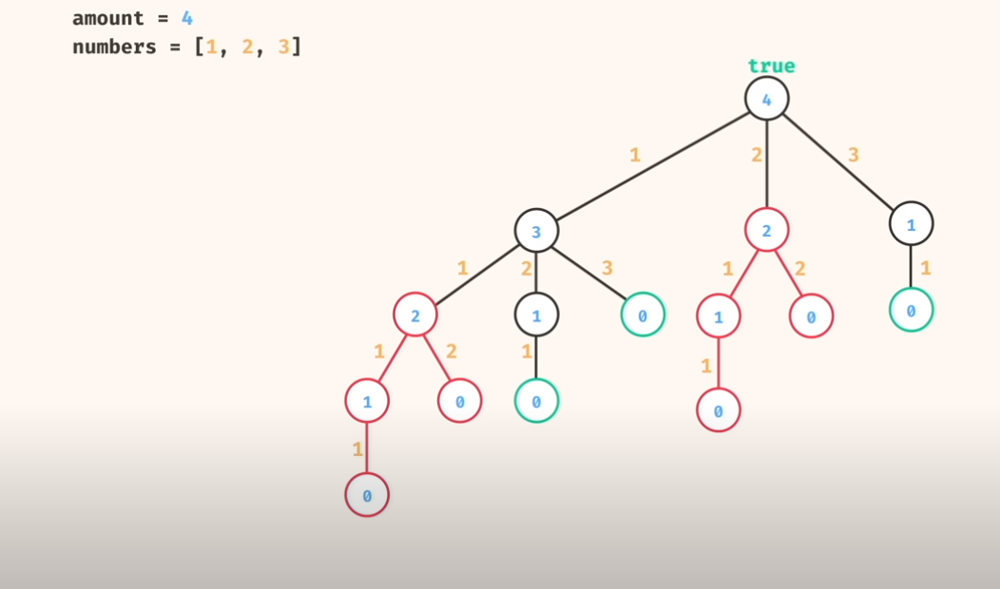

Problem 4
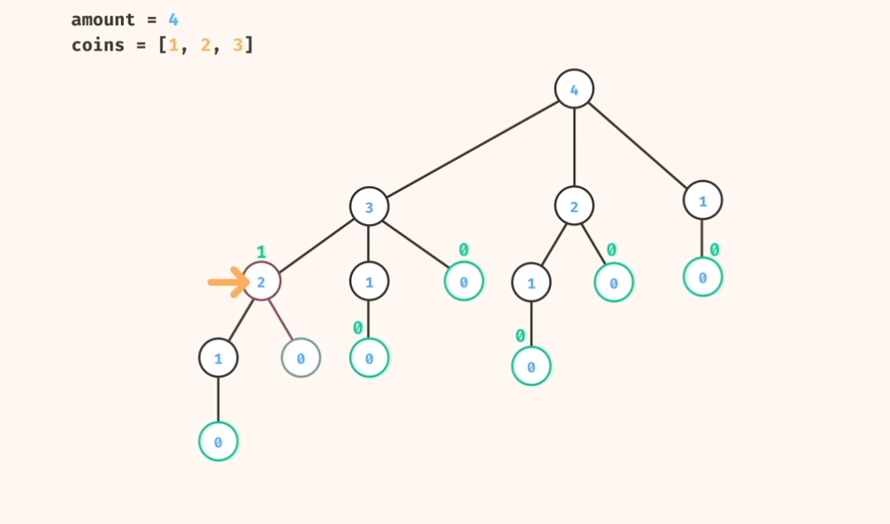

Problem 5
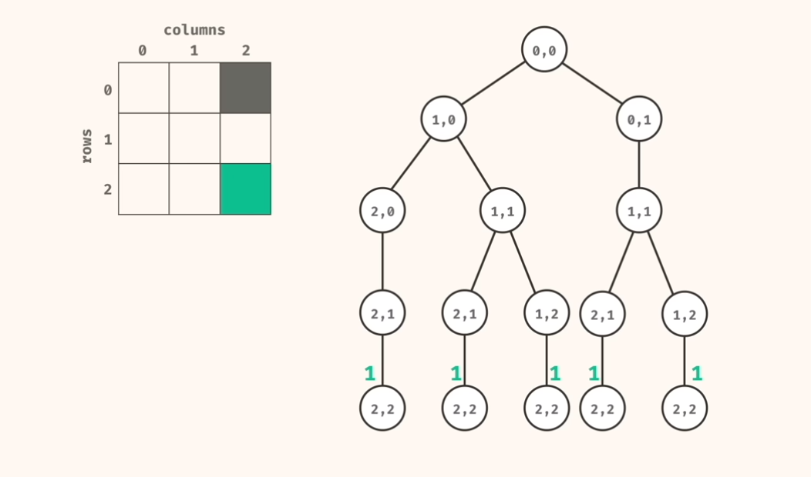

Problem 6
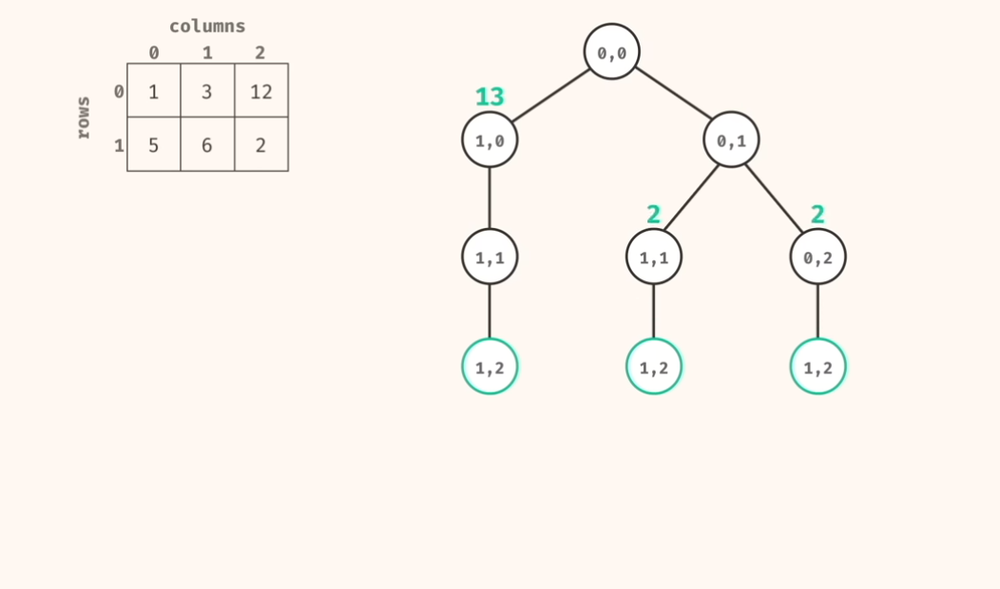
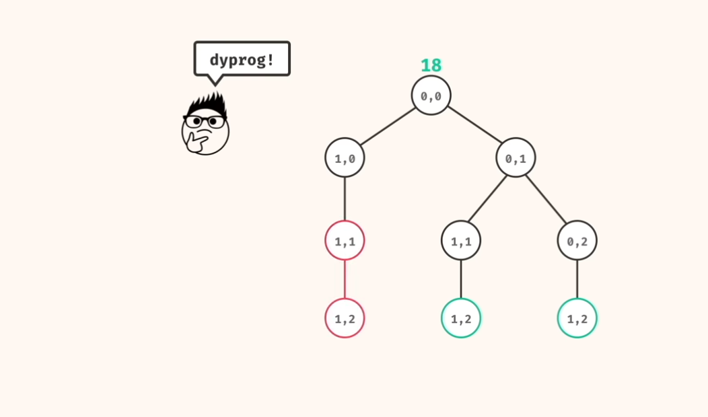

Prolbem 8
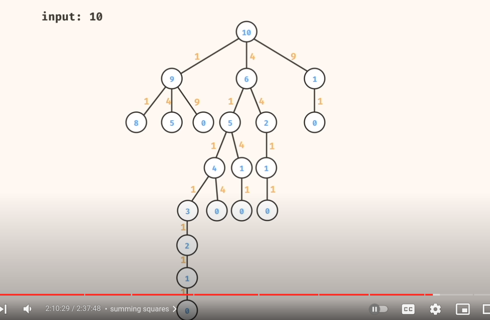
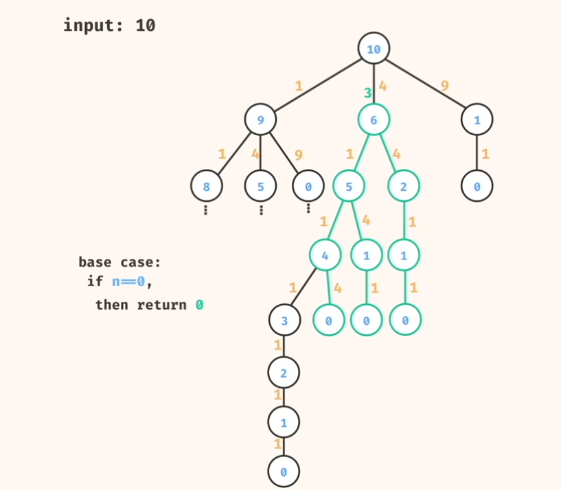

Problem 9
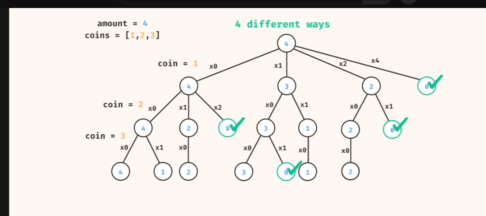

Problem 10 - Array Stepper
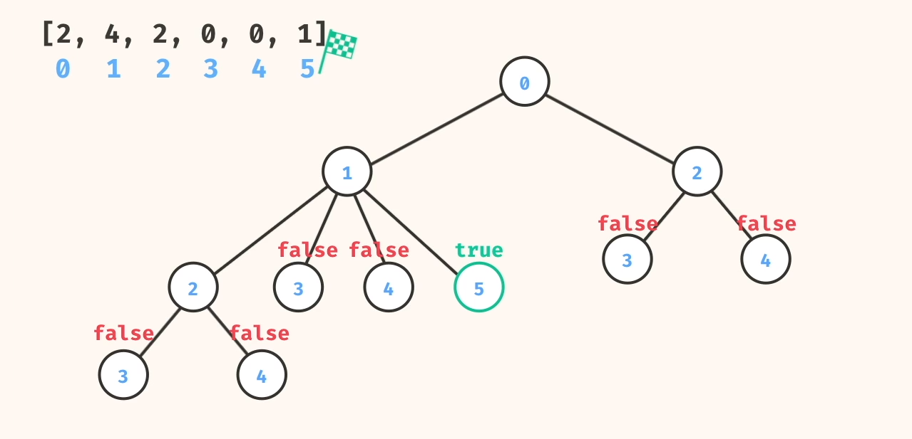

Problem 11 - Palindrome subsequence
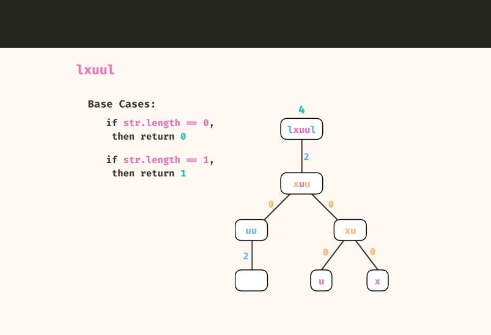
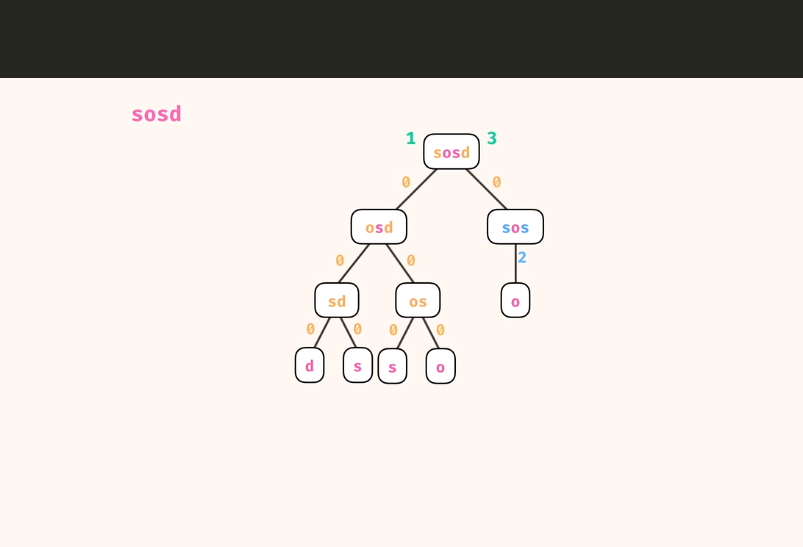

Part 2
https://www.youtube.com/watch?v=oBt53YbR9Kk&t=47s

